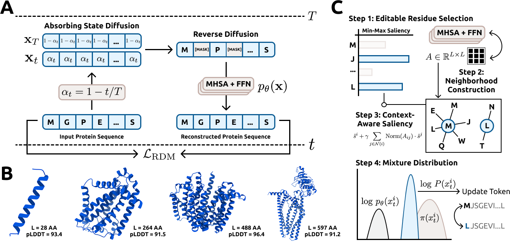

# Token-Level Guided Discrete Diffusion for Membrane Protein Design

arXiv preprint: ...

Reparameterized diffusion models (RDMs) have recently matched autoregressive methods in protein generation, motivating their use for challenging tasks such as designing membrane proteins, which possess interleaved soluble and transmembrane (TM) regions.  

We introduce ***Membrane Diffusion Language Model (MemDLM)***, a fine-tuned RDM-based protein language model that enables controllable membrane protein sequence design. MemDLM-generated sequences recapitulate the TM residue density and structural features of natural membrane proteins, achieving comparable biological plausibility and outperforming state-of-the-art diffusion baselines in motif scaffolding tasks by producing:  

- Lower perplexity  
- Higher BLOSUM-62 scores  
- Improved pLDDT confidence  

To enhance controllability, we develop ***Per-Token Guidance (PET)***, a novel classifier-guided sampling strategy that selectively solubilizes residues while preserving conserved TM domains. This yields sequences with reduced TM density but intact functional cores.  

Importantly, MemDLM designs validated in TOXCAT β-lactamase growth assays demonstrate successful TM insertion, distinguishing high-quality generated sequences from poor ones.  

Together, our framework establishes the first experimentally validated diffusion-based model for rational membrane protein generation, integrating *de novo* design, motif scaffolding, and targeted property optimization.  

## **Repository Authors**
- <u>Shrey Goel</u> – undergraduate student at Duke University  
- <u>Pranam Chatterjee</u> – Assistant Professor at University of Pennsylvania  
